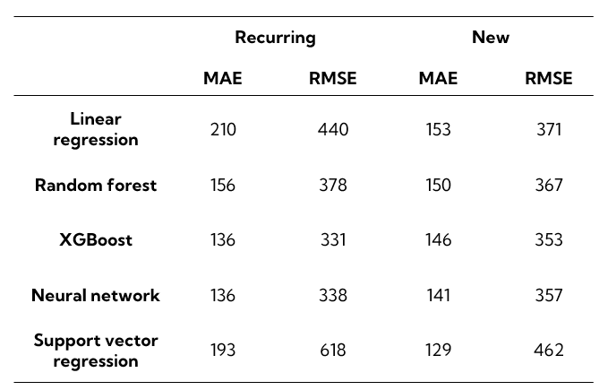
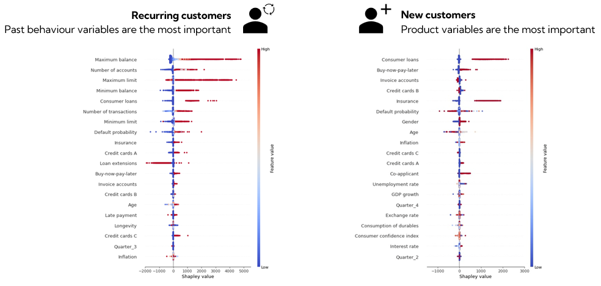
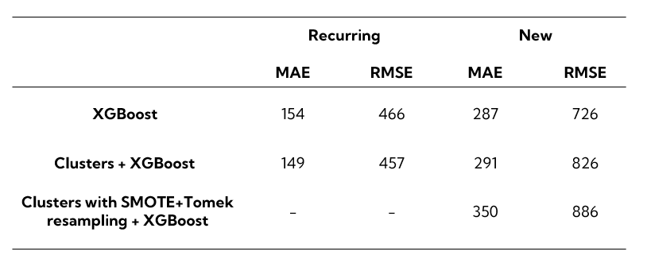

# Individual revenue forecasting in the banking sector

This project analyses data from a Swedish bank combined with macroeconomic indicators to forecast revenues for individual customers. Separate models are created for recurring customers and customers who have just joined the bank. Five machine learning methods are compared to predict revenues: linear regression, random forest, XGBoost, neural network and support vector regression. XGBoost is shown to outperform all other models when comparing both mean absolute error and mean squared error:

 The most important variables when forecasting individual revenues can be found below:

Furthermore, a cluster-based method is proposed where customers are first assigned a cluster and then different models are trained for each cluster. The cluster-based method is built on clustering customers based on their revenues without looking into any other characteristics. This way the customers are split into revenue segments. Having defined the clusters, one can train the best model for each cluster. Afterwards, forecasts are obtained in a two-step procedure. Firstly, by assigning a customer to a revenue segment using a classification model. Secondly, by running that observation through the model for the corresponding cluster and generating a prediction of revenue for that individual. To account for the class-imbalance in the revenue segments, a combination of over-sampling and data cleaning techniques called SMOTE+Tomek is applied.

From the results it is apparent that there is a small improvement for recurring customers but a significant increase in forecasting error for new customers:

 This difference in results is caused by the distinct classification accuracy when assigning the clusters. For recurring customers, the classification model is very precise and, as such, the method improves forecasts by making predictions on models that are better fit for that customer segment. For new customers, the classification model makes excessive errors when assigning clusters, making prediction errors more exacerbated. To conclude, the cluster-based method is viable if the classificaion of customers into said clusters is accurate enough. 

